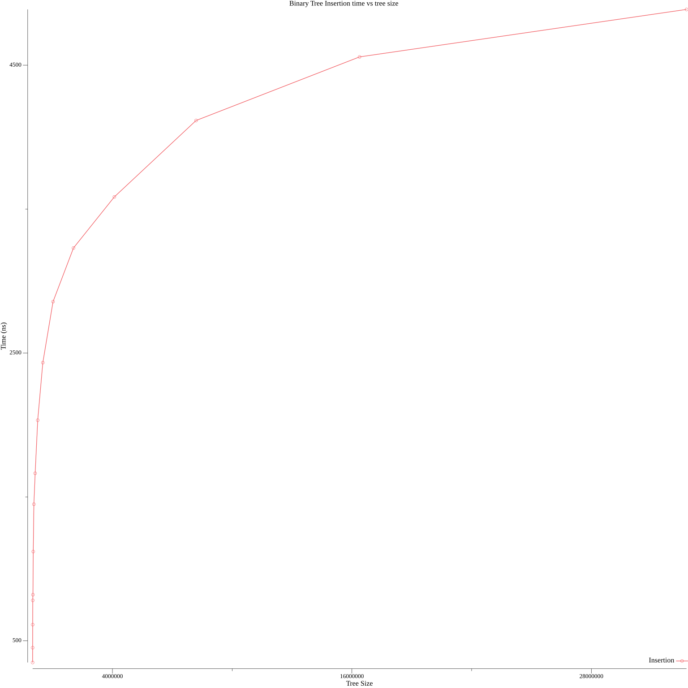
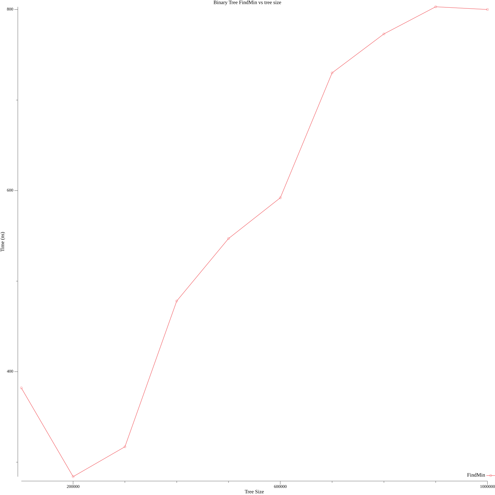

# Data structures
> Option 3

I implemented a standard unbalanced binary tree. It performs insertions in O(log n) time as shown by this graph:

(Insertion time is in nanoseconds, x axis is the number of elements in the tree)

It also performs find min in O(log n) time as shown by this graph:

This graph is also logarithmic, but the highly randomized nature of the tests makes it more chaotic.

I also implemented an AVL tree, which also performs insert and find-min in O(log n) time. 

(insertion)

(find min)

